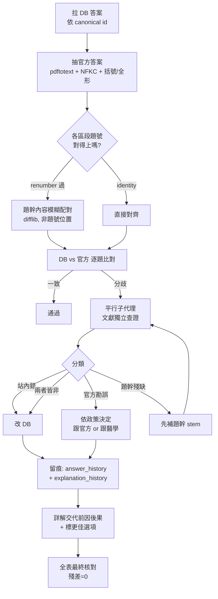

# 答案審計方法論

如何驗證一份考古題題庫的「正確答案」是否可信，並在需要時安全地更正。

本頁是**次專科無關**的通用流程——不管題庫是血液、心臟、感染還是非醫學領域，只要是「有官方答案的選擇題庫」都適用。內容抽象自 2026-07-23 對 114 年題庫的一次實戰審計（100 題、21 題更正），把踩到的坑寫成可重複的步驟。

核心信念一句話：**單一來源不可信；正確答案要由多個彼此獨立的來源交叉佐證。**

---

## 一、來源分級：先搞清楚手上是什麼

審計前先把「答案來源」分層，因為它們的權威性與失真方式都不同：

| 來源 | 代表什麼 | 典型失真 |
| --- | --- | --- |
| **官方答案欄** | 考試主辦單位實際計分的答案 | 本身可能是勘誤題（醫學上錯）；PDF 抽取可能錯位 |
| **站內 DB（`questions.answer`）** | 使用者實際看到的答案 | 匯入時**人工/OCR 轉錄錯**；被社群改過又被 re-import 蓋回 |
| **專家詳解講義** | 有人逐題推理過的第二意見 | 可能刻意不跟隨官方（標注官方有誤） |
| **文獻／指引** | 醫學事實的最終裁判 | 版本時效（新舊教材結論不同） |
| **手動轉貼的答案** | 上述任一的二手謄本 | 再抄一次就再失真一次 |

**教訓**：不要把「站內 DB」或「手貼答案」當基準去覆蓋別人。DB 的值有可能是**刻意的社群更正**（見 [踩過的坑](Gotchas) 的 import 蓋掉升級答案），也有可能只是轉錄錯——兩者長得一樣，必須靠外部來源分辨。

---

## 二、最危險的坑：用「題號位置」對齊不同來源

**症狀**：把 DB 第 N 題的答案，直接對上官方答案清單的第 N 個，得到一堆差異；但逐題細看，比對的根本是**不同的題目**。

**成因**：兩份來源的題號可能不是同一套。本題庫共同區跑過一支 renumber，導致 `questions.number` 欄、`id` 尾碼、原始 PDF 題號**三者互不相同**。用位置對齊，等於拿 A 題的答案去比 B 題，製造出大量**假差異**。114 那次初版就因此誤判了 8 題「官方錯」，實際 DB 與官方完全一致。

**修法**：**永遠用題幹內容配對，不要用題號位置。** 標準化字串後做模糊比對：

```python
import difflib, re, unicodedata
def norm(s):
    return re.sub(r'\s+', '', unicodedata.normalize('NFKC', s or '')).lower()

def best_match(db_stem, pdf_items):          # pdf_items: {num: {'stem':..., 'ans':...}}
    return max(pdf_items.items(),
               key=lambda kv: difflib.SequenceMatcher(None, norm(kv[1]['stem']), norm(db_stem)).ratio())
```

先驗證某個區段是否為 identity 對應（配到的題號 == 自己）再放心；配對相似度太低（如 < 0.6）的題要人工確認，別讓假配對污染結論。`NFKC` 正規化很重要——全形英數、破折號都會讓字面比對失敗。

---

## 三、把官方答案「抽乾淨」

官方答案往往藏在你以為沒有答案的檔案裡。

- 本題庫兩份「**無答案**」PDF，其實在每題首行行末內嵌了答案欄字母——`pdftotext -layout` 就能抽出來。
- 抽取要處理三種格式雜訊：
  - 一般題：行末單一大寫字母 `... C`
  - 連鎖題（共用題幹）：答案用括號 `... (C)`
  - **全形字母**：`Ｄ` 不等於 `D`，先 `NFKC` 正規化再抓
- 抽完務必**回頭核對總數**（例如 70/70、30/30）；缺的通常就是上述格式沒吃到。

驗證抽取正確性的好辦法：如果另有一份「手貼答案」，比對兩者應**逐題一致**；一致就代表抽取無誤、且手貼版可信。114 那次兩者 100% 吻合，反而證明了 PDF 抽取沒問題。

---

## 四、逐題裁決：讓多個獨立來源互相佐證

對每一題 **DB ≠ 官方** 的分歧，不要憑記憶下判斷，交由獨立查證：

- 用平行子代理（每個負責一批）以 **web search / 文獻** 獨立判定正解，回傳「正解字母 + 信心 + 依據 + 站內對/官方對/兩者皆非」。
- 留意題目**極性**：`which is WRONG / Except / 何者錯誤` 要選「錯的敘述」；`何者正確` 選對的。極性看反，整題判斷都會顛倒。
- 複選組合題（`1+2+4`）若 DB 題幹**沒匯入子敘述**，任何裁決都是猜——必須先從原始 PDF 補回子敘述才能定案（見第六節）。

裁決後把每題歸類：

| 類別 | 意義 | 處置 |
| --- | --- | --- |
| **站內錯** | 官方＝文獻，皆 ≠ DB | 改 DB（雙重佐證，信心高） |
| **官方錯（勘誤題）** | DB＝文獻，官方醫學上錯 | 看政策：跟官方 or 跟醫學 |
| **兩者皆非** | 正解是第三個選項 | 改 DB 為正解 |
| **無法定案** | 題幹殘缺／選項重複等 | 補題幹後再審，先不動 |

**關鍵區分**：「DB 與官方不同」不等於「DB 錯」。當官方本身是勘誤題（醫學上錯）時，DB 反而可能是對的。務必兩問分開：**(a) DB 跟官方一致嗎？ (b) 官方醫學上對嗎？**

---

## 五、更正政策：跟官方，還是跟醫學？

這是一個**要由題庫擁有者拍板的政策決定**，不是技術問題：

- **以官方為準（強制對齊計分答案）**：適合「模擬真實考試」的用途。此時即使某題官方醫學上有疑義，也照官方設定，但**必須在詳解交代前因後果，並指出可能更適當的選項**，讓作答者理解爭點而不是被誤導。
- **以醫學事實為準**：適合「純學習」用途，把 DB 設為文獻支持的正解，官方勘誤題就偏離官方。

無論選哪種，**每一題動過的都要在詳解說明**：原答案、新答案、為什麼、更好的選項是哪個。答案改了卻不解釋，等於製造下一個「不知為何是這樣」的坑。

---

## 六、殘缺題：先補題幹，再談答案

複選題若 DB 只存了組合選項（`(A) 1+2+4`）卻沒存子敘述 (1)(2)(3)(4)，題目本身就是壞的，答案對錯無從談起。

- 從權威來源（PDF／詳解講義）抽回完整子敘述，寫回 `questions.stem`。
- 順手核對：原卷選項有沒有重複（如 (B) 與 (D) 都是 `2,3,4`）等考卷瑕疵，一併在詳解註明。
- 補題幹與改答案可以同一批做，但**分開記錄**用途。

---

## 七、安全落地：一律留痕，永不無痕覆蓋

本題庫已有兩張稽核表，改答案／改詳解都要走它們（也是 `verdict-by-oe` skill 的標準流程）：

```sql
-- 改答案：先補一筆 original（若無），再記一筆 admin 異動，最後才 UPDATE
INSERT INTO answer_history (question_id, previous_answer, new_answer, source, changed_by, changed_at)
SELECT id, answer, answer, 'original', NULL, strftime('%s','now')*1000
FROM questions WHERE id = :qid AND NOT EXISTS (SELECT 1 FROM answer_history WHERE question_id = :qid);

INSERT INTO answer_history (question_id, previous_answer, new_answer, source, changed_by, changed_at)
SELECT id, answer, :new, 'admin', :email, strftime('%s','now')*1000
FROM questions WHERE id = :qid AND answer <> :new;

UPDATE questions SET answer = :new WHERE id = :qid AND answer <> :new;
```

```sql
-- 改詳解：先把現行版本備份進 history，再覆蓋（version+1）
INSERT INTO explanation_history (question_id, version, content_json, updated_by, updated_at)
SELECT question_id, version, content_json, COALESCE(updated_by,'system'), updated_at
FROM explanations WHERE question_id = :qid;

UPDATE explanations
SET content_json = :new_json, version = version + 1,
    updated_by = :email, updated_at = strftime('%s','now')*1000,
    editing_by = NULL, editing_until = NULL
WHERE question_id = :qid;
```

原則：

- **詳解用「前置更正區塊」而非整篇取代**——把「🔧 答案更正」放最上面，原有內容（可能含人工精修的圖文與引用）保留在下方。整篇覆蓋大內容是不可逆的損失。
- 詳解內容是 **TipTap JSON**，不是 HTML／純文字（見 [Head First 架構觀](Head-First-Software-Architecture) 的儲存決策）；用程式產生節點，別手拼字串。
- 全部套用後，做一次**全表最終核對**（DB vs 官方，題幹配對），確認殘差為 0。

---

## 八、流程總覽



---

## 九、審計清單（可直接照跑）

1. [ ] 用 canonical `id`（非 `number` 欄）拉出 DB 全部答案。
2. [ ] 抽官方答案，核對總數；處理括號與全形字母。
3. [ ] **題幹配對**跨來源，低相似度題標記人工。
4. [ ] 逐題比對，分歧題交獨立查證（注意題目極性）。
5. [ ] 殘缺複選題先補子敘述回 `stem`。
6. [ ] 依政策決定「跟官方／跟醫學」。
7. [ ] 改動走 `answer_history` / `explanation_history`，詳解前置更正區塊。
8. [ ] 每一題動過的都在詳解說明來龍去脈與更佳選項。
9. [ ] 全表最終核對，殘差為 0。

---

延伸閱讀：[踩過的坑](Gotchas)（import 蓋答案、renumber）、[維運手冊](Maintenance)（D1 操作）、[技術債](Tech-Debt)、[Head First 架構觀](Head-First-Software-Architecture)（TipTap JSON 儲存、`attempts` 為真相來源）。
