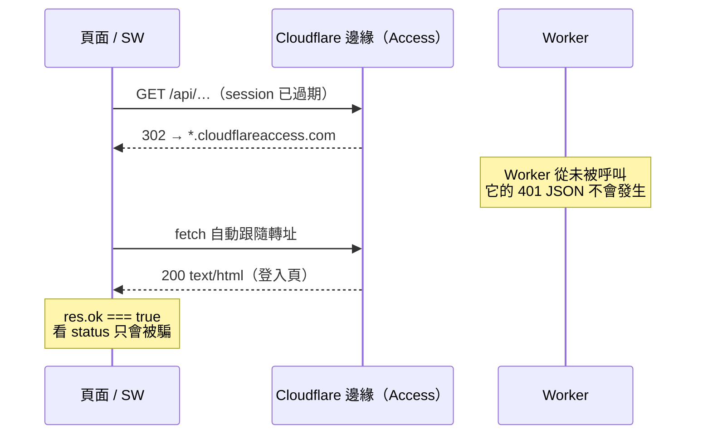

# 踩過的坑

真實踩過、花過時間的陷阱。每則：**症狀 → 成因 → 修法**。依代價排序，不寫通則性建議。

大部分來自 2026-07-20 那天 —— 九個功能以平行分支同時開發、合併、上線，再回頭修 bug。密集操作把平時遇不到的坑一次踩滿。

---

## 一、綠勾不等於上線

**症狀**：推送後 GitHub Actions 三支 workflow 全部 success，但正式站行為完全沒變。

**成因**：CI 是 path-gated 的 —— `deploy-worker.yml` 只在**純** `worker/**` 的推送才部署，`deploy-pages.yml` 只在**純** `frontend/**`。一次同時動到兩邊的推送，兩個 guard 互相把對方擋掉，各自印出 `skipping auto-deploy` 然後**以 success 收場**。綠勾的語意是「workflow 成功執行了它的判斷」，不是「已部署」。

**修法**：同時動到 worker 與 frontend 時，一律手動部署兩邊。要確認到底有沒有真的部署，看 log 而不是看勾：

```bash
gh run view <id> --log | grep -i "skipping\|Version ID\|Deployment complete"
```

---

## 二、rebase 合併後，分支「已合併」的判斷會全錯

**症狀**：九個 PR 都顯示 MERGED，但 `git merge-base --is-ancestor feat/x main` 對**每一個**都回 false。差點據此認定工作沒合併進去。

**成因**：用 `--rebase` 合併會改寫 commit SHA，原分支的 tip 自然不是 main 的祖先。`--is-ancestor` 問的是「同一顆 commit 在不在」，而 rebase 之後那顆 commit 已經不存在了。

**修法**：用 patch-id 比對內容而不是 SHA：

```bash
git cherry main feat/x        # 前綴 + 的才是「內容不在 main」
```

注意空 commit 會被 rebase 丟掉，所以 `git cherry` 可能列出一個永遠對不上的空 commit —— 用 `git show --stat` 確認它沒有檔案變更即可。

---

## 三、物件識別當 effect 依賴 → 無限 render 迴圈

**代價最高的一個 bug**，而且症狀完全不像成因。

**症狀**：個人筆記在唯讀檢視下，選字之後的「螢光標記」popup 不會出現。裝置發燙。

**成因**：`AnnotatableContent` 兩個 effect 的依賴陣列放的是 `content` **物件**，而 `NoteContent` 的 `SectionBody` 每次 render 都重建一個新的 doc：

```tsx
<SectionBody doc={{ type: 'doc', content: buf }} />   // 每次 render 都是新物件
```

於是每次 render 都執行 `editor.commands.setContent()` —— 那會**清掉選取範圍**，而 popup 正是建立在選取上的，mouseup 還來不及處理選取就沒了。更糟的是同一個 effect 會 `setDocRev(r => r + 1)` 觸發 render，再產生新物件，再跑 effect：**閉環**。第二個 effect 則是每輪打一次 `reconcileHighlight`，變成每 render 一個網路請求。

詳解那條路徑沒事，因為 `explanationJson` 有 `useMemo`，識別穩定。**只有筆記會踩到**。

**修法**：依賴改成內容雜湊而非物件識別 —— 文字真的變了才重跑：

```tsx
}, [baseHash, editor, storeKey]);   // 不是 [content, ...]
```

**推論**：任何把 `content` / `doc` / 陣列 當 effect 依賴的地方，先問「呼叫端每次 render 會不會給新物件」。這條在 TipTap 這種「effect 內會改動 editor 狀態」的元件上特別致命，因為改動本身會再觸發 render。

---

## 四、JSON schema 的 `minItems` 會讓受限解碼掛住

**症狀**：自動挖空按下去跑很久，最後回「AI 這次挑不出關鍵詞」。

**成因**：Workers AI 的 structured output 是文法受限解碼。schema 寫 `minItems: 10` 等於**強迫模型一直產出直到湊滿下限**，在 6000 字的輸入上會跑很久，然後撞上 `max_tokens`，JSON 陣列沒收尾，解析失敗。

**修法**：只設上限，密度改用 prompt 要求 —— prompt 沒達成不會爆，schema 沒達成會。修完同一份輸入 2.6 秒回 40 個詞。

---

## 五、把錯誤吞成空結果，等於對使用者說謊

**症狀**：同上。使用者看到的是「AI 挑不出關鍵詞」，實際上是呼叫失敗。

**成因**：

```ts
} catch { terms = []; }        // 所有錯誤 → 空陣列 → 「挑不出」
```

服務中斷與「真的沒有可挑的詞」變成同一個畫面，無從分辨，也不會留下任何線索可查。

**修法**：錯誤要 `console.error`（`wrangler tail` 才看得到），回傳的 reason 要能區分 `ai_error` 與 `ai_empty`，並且失敗時降級重試一次（較小視窗、較少數量）—— 稀疏的結果勝過沒有結果。

---

## 六、看起來沒保存，其實是保存了但沒接線

**症狀**：自動挖空的空格重新整理就消失，得再按一次按鈕——看起來像「這功能不會保存」。

**成因**：關鍵詞其實一直存在 D1（`explanation_cloze` 全站共用、`note_cloze` 每人一份）。缺的是**「這位讀者在這題開過自動挖空」這個事實沒有被記錄**，所以重新載入後前端狀態歸零。更糟的是，當時再按一次會**重新花一次 Workers AI 額度**去算出一模一樣的結果。

**修法**：記住開關（每題 × 每區塊），並新增 `cached_only=1` 讀取模式——只讀快取、絕不呼叫 AI。快取真的失效時（筆記被改、prompt 版本變動）就乾淨地回未挖空狀態，而不是偷偷再算一次。

**刻意沒選的簡單解**：「伺服器有詞就還原」。那是錯的——`explanation_cloze` 是每份詳解版本一列、**全站共用**，所以別人按過自我測驗之後，你一打開詳解就被挖了一堆空，而你根本沒要求。要記的是「**你**開過」，不是「有人算過」。

**推論**：使用者說「這個不會保存」時，先確認到底是哪一層沒保存。資料層、狀態層、還原路徑是三件事，缺任何一件症狀都一樣，但修法完全不同。

---

## 七、D1 的綁定參數有上限

**症狀**：匯出 200 題時 `D1_ERROR: too many SQL variables`。

**成因**：`… IN (?, ?, …)` 展開的參數量超過 D1 上限（實測約 100）。

**修法**：任何把清單展開成 placeholder 的地方都要有天花板。集中在 `worker/lib/sql-params.ts`：`chunkParams()` 分批（90，留餘裕給同句的其他參數）、`parseTagList()` 對使用者輸入的逗號字串設上限。

**推論**：當時還有三處**使用者可控**的 tag 清單沒有上限（`/api/search`、`/api/questions`、匯出 scope）—— 逗號打夠多就是一個任何人都能觸發的 500。找到一處這種 bug 時，一定要全 repo 掃同類。

---

## 八、Cloudflare Access 的 302 會被 fetch 跟隨，而且 `res.ok === true`

**症狀**：session 過期後，API 回應變成 Access 登入頁的 HTML，卻被當成成功資料處理。

**成因**：worker 自己一律回 401 JSON（`worker/lib/auth.ts`），但 **302 是邊緣做的，worker 根本沒被呼叫到**。`fetch` 預設跟隨轉址，於是拿到：

```
res.status     === 200
res.ok         === true      ← status 完全不能用來判斷
res.redirected === true
res.url          host 是 *.cloudflareaccess.com
content-type     text/html
```



`frontend/src/lib/api.ts` 原本在 JSON parse 失敗時把純文字塞進 `data` 回傳 —— 登入頁 HTML 就這樣被當成 API 資料。匯出功能更慘：會把登入頁**存成檔案下載給使用者**。

**修法**：判斷條件看 `res.redirected` / 跨源 `res.url` / content-type，**永遠不要看 status**。service worker 尤其致命：登入頁一旦被寫進 cache，使用者每次開 app 都看到快取的登入頁，而且 SW 不再碰網路，**無法自我修復**。因此 SW 的 `cacheWillUpdate` 用自寫的守衛（workbox 內建的 `cacheableResponse` 只看 status，看不出這件事），並採 fail-safe：判斷不出來就當成是登入頁、不要快取。

---

## 九、Access bypass 是精確路徑，不是前綴萬用

**症狀**：PWA 裝不起來；SW 更新因 MIME 錯誤永久失敗。

**成因**：`scripts/setup-public-bypass.sh` 建立的 bypass app 是**逐條精確路徑**。清單裡有 `/` 不代表 `/manifest.webmanifest`、`/sw.js`、`/icons/*` 也通（收尾驗證明寫 `/api/health` 仍應 302，正可佐證）。

**修法**：新增任何必須在未登入狀態下取得的靜態資源，都要進 bypass 清單。`sw-kill.js` 一定要 bypass —— 那是 SW 出事時唯一的剎車，而出事的人通常正卡在登入不了的狀態。

順帶一提：precache 清單裡的 `/index.html` 在自訂網域上回 **308**（Pages 正規化到 `/`），而不是 200。

---

## 十、worktree 拿不到被 gitignore 的設定檔

**症狀**：在新 worktree 裡 `pnpm build` 直接壞。

**成因**：`config.toml`、`wrangler.toml`、`.dev.vars` 都在 `.gitignore` 裡，乾淨簽出的 worktree 不會有它們。而 `frontend/vite.config.ts` 在 build time 要讀 `config.toml` 注入 `__APP_CONFIG__`。

**修法**：worktree 開好後先從主工作區複製，再 `pnpm install`：

```bash
cp /path/to/main/{config.toml,wrangler.toml,.dev.vars} .
pnpm install && (cd frontend && pnpm install)
```

同理：需要新增 worker 環境變數時，`wrangler.toml` 的改動**進不了 PR**。要改的是 `wrangler.example.toml` + `scripts/setup.sh` 的鏡射機制，並在 PR 描述寫清楚整合者要手動補哪幾行。

---

## 十一、平行開發必須先把 migration 編號分配死

**症狀**：六份獨立寫成的實作計畫，全部聲稱要用 `0023`。

**成因**：每個人（或每個 agent）都正確地查了「目前最後一號」，然後都挑了下一號。

**修法**：平行動工前由整合者**全域分配唯一編號**，並在每份計畫寫明「動手前重新確認 `ls migrations/ | sort | tail -1`」。編號本身沒有順序語意 —— D1 逐支記錄已套用的 migration，晚合併的小號照樣會被套用。

---

## 十二、同名 route 會靜默覆蓋

**症狀**：（未發生，合併前攔下）兩個功能各自註冊 `GET /api/review/pacing`。

**成因**：Hono 不會對重複註冊報錯，後者直接吃掉前者。兩個分支各自 build、各自測試都會過，**合併後才炸，而且症狀是「某個功能莫名其妙沒了」**。

**修法**：平行分支動工前先讀當下的 main，不要照計畫寫成時的行號與路由表施工。這也是為什麼分波合併（每波併回 main 後下一波才分出）比九路齊發安全。

---

## 十三、測試全綠不代表功能會動

貫穿當天的教訓。287 個 worker 測試 + 79 個前端測試全過、`tsc` 零錯誤、build 乾淨 —— 而同時：自動挖空在正式站完全壞掉、個人筆記的畫記 popup 消失、PWA 的重新載入按鈕沒反應。

原因很簡單：**測試涵蓋的是純函式，壞掉的是整合與 React 生命週期**。

實際有效的驗證方式：

```bash
pnpm exec wrangler dev --port 8787        # 本地 worker（會 bypass Access）
curl -H "X-Dev-Email: you@example.com" "http://127.0.0.1:8787/api/…"
```

本地 dev 的 Workers AI 是直接打真的 API，所以連 AI 行為都能實測。自動挖空的根因就是這樣三分鐘定位的 —— 而在那之前已經憑猜測改了兩輪。

**推論**：改完 AI / 整合 / 前端生命週期相關的東西，「跑起來打一次」的成本遠低於讓使用者當測試員。

---

## 十四、同網域下 `/tg/*` 不登記 route 就被 Pages 吃掉

**症狀**：Telegram webhook 永遠收不到 update；手動 `GET /tg/webhook` 回的是 SPA 的 `index.html`，`POST` 回 405。

**成因**：Pages 服務 apex 的 SPA，Worker 只在 `wrangler.toml [[routes]]` 明列的路徑上接管。`/api/*`、`/img/*`、`/pdf/*` 都登記了，但新增的 `/tg/*` 若漏登記，同網域請求就落到 Pages 當成前端路由——GET 回 `index.html`、POST 回 405，Worker 的 `/tg/webhook` handler 根本沒被呼叫到。

**修法**：`wrangler.toml`（與 `wrangler.example.toml`）加 `[[routes]] pattern = "<host>/tg/*"`。與 `/api/*` 同理——**新增任何不走 Pages 的路徑前綴都要補一條 route**。

---

## 十五、FSRS 到期題:答題不推進排程 → 每天推同一題

**症狀**：Telegram 每日推播天天推同一題（實測卡在 114-003）。

**成因**：選題第一優先是「到期題、依 `due_at` 最早」。若聊天內作答只記 `attempts` 而不推進 FSRS，那張卡的 `due_at` 永遠不變 → 每次 tick 都選到同一張。

**修法**：Telegram 作答走**與網頁 anki 複習完全相同**的寫入路徑（`recordAnswer` in `tg-store.ts`）：答對 → FSRS `good`、答錯 → `again`，同批寫 `fsrs_cards`（推進 `due_at`）+ `fsrs_review_logs` + `review_progress` + `attempts`。**跨入口的複習必須共用同一套排程推進**，否則到期佇列會鬼打牆。

---

## 十六、EmbedPDF「一律整份下載」——大教科書必須拆冊

**症狀**：一份 100 MB 教科書單檔丟給既有 PDF 閱讀器，開頁前先卡著抓 100 MB。

**成因**：`worker/routes/pdf.ts` 的 Range / `206` 早就備好，但 **EmbedPDF 目前不發 range 請求**（官方文件明載 open-from-URL *"always downloads the entire PDF file"*，`range-request` mode "reserved for future use"）。渲染層雖有 tiling 虛擬化（只 rasterize 視窗附近幾頁），但那是**畫**的省，不是**抓**的省——網路下載仍是整份。

**修法**：教科書匯入前按章節拆成 20–40 冊、各 3–8 MB（citation 存 `(slug, local_page)`，FTS 鍵天然對上，跳頁 = 該冊本地頁，零額外邏輯）。7 份講義各 ~10 MB 整份下載也秒開，**不需動**。真要單檔串流得換 pdf.js（原生支援 byte-serving），代價是多一套引擎——教科書唯讀、不需標註，v1 選了拆冊。

---

## 十七、FTS 選字 lookup:token 要 OR 串接,不是 AND

**症狀**：在題幹選「Auer rods」問教科書，回空；選長句、選「CRAB criteria」也回空。

**成因**：把選取的多個 token 用 `AND` 串成 FTS query，等於要求**同一頁全部命中**。但教科書頁面可能寫成單數（"Auer rod"）、術語跨頁分散、長選取夾帶雜訊詞——AND 於是一個都不回。

**修法**：意圖是「跳到**最相關**的一頁」而非「精確布林檢索」，所以 token 用 **`OR` 串接**，讓 `bm25()` 把命中最多 / 最罕見詞的頁排前面。實測 OR 對上述三例都回正確頁且 top-1 命中。另需把軟連字符（U+00AD 等）正規化成 ASCII `-`，與匯入端一致（unicode61 以 `-` 為分詞邊界，否則 "T-cell" 兩側分詞不同）。

---

## 十八、冪等性:key 每次 render 重產等於沒做

**症狀**（設計期攔下）：加了 `Idempotency-Key` 但重送仍重複寫入 `attempts` / 重複留言。

**成因**：前端若在 render 期間（或每次點擊）新產一個 UUID 當 key，同一個使用者動作的重送會帶**不同**的 key，`request_dedup` 查無前一筆 → 照樣執行。key 的意義是「同一次使用者意圖」，不是「同一次請求」。

**修法**：一次使用者動作產一個**穩定** UUID（`useRef` / component-scoped ref），重送沿用同一個。伺服器端 `request_dedup` 的 PK 用 `${email}:${key}` 命名空間化防跨使用者碰撞。設計原則是**向後相容**：沒帶 key 時行為與現況完全一致，帶了才走 replay——線上路徑零風險。

---

## 十九、其他一次性的坑

| 坑 | 說明 |
|---|---|
| `pnpm deploy` | 撞到 pnpm 內建指令（`ERR_PNPM_CANNOT_DEPLOY`），要用 `pnpm run deploy` |
| Pages 部署跑到 preview | 從 feature branch 部署會上 preview 環境；正式要 `--branch=main` |
| `new URL(c.req.url).origin` | `wrangler dev` 下是 `http:`，會把壞掉的絕對 URL 烤進匯出檔 |
| 交卷時清掉標記 | 舊 `submit()` 會 `sessionStorage.removeItem('exam-marks-…')` —— 這才是「結果頁無法只看標記題」的真正根因，不是同步問題 |
| AI 模型 deprecated | `@cf/meta/llama-3.1-8b-instruct` 下架後所有 AI 端點靜默失效；模型 ID 已集中在 `worker/lib/ai-models.ts` |
| D1 的 `EXISTS()` 回 0/1 | 不是 boolean，TypeScript 型別要放寬，否則編不過 |
| LSP 診斷可能是殘影 | 平行 worktree 被刪除後，編輯器仍會報大量「找不到模組」。以實際 `tsc --noEmit` / `pnpm build` 為準 |
| 新依賴後 build 假失敗 | 合併帶進新套件（如 `vite-plugin-pwa`）後，主工作區沒跑 `pnpm install` 會型別失敗，不是程式碼問題 |

---

## 相關頁面

- [技術債 Tech-Debt](Tech-Debt) —— 已知但暫時不還的債
- [Head First 架構觀](Head-First-Software-Architecture) —— 這些坑對應的架構決策
- [維運手冊 Maintenance](Maintenance) —— 部署與除錯指令
